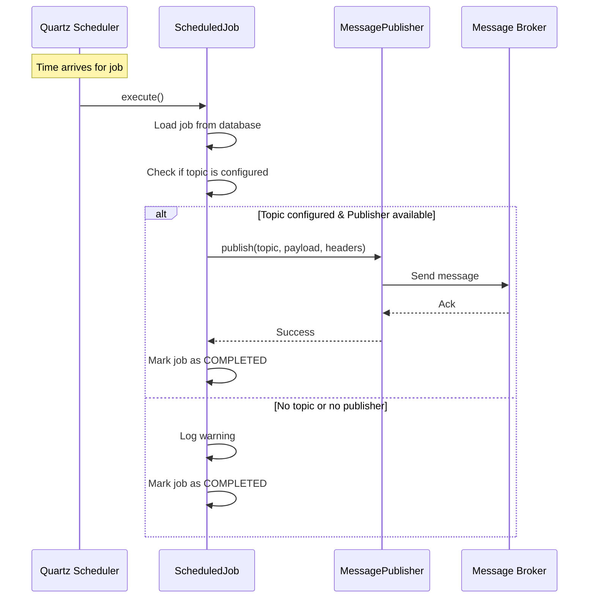

# Message Publishing Feature

## Overview

When a CRON or delayed job's scheduled time arrives, the scheduler can automatically publish a message to a configured topic/queue on your message provider (Kafka, RabbitMQ, AWS SQS, etc.).

## How It Works



## Usage

### 1. Define Job with Topic

When creating a job, specify the `topic` field:

**CRON Job Example:**
```json
{
  "name": "Daily Report Generator",
  "description": "Triggers daily report generation",
  "cronExpression": "0 0 9 * * ?",
  "topic": "reports.daily",
  "payload": "{\"reportType\": \"daily\", \"format\": \"PDF\"}",
  "createdBy": "admin"
}
```

**Delayed Job Example:**
```json
{
  "name": "Meeting Reminder",
  "description": "Send meeting reminder",
  "scheduledTime": "2026-02-14T14:30:00",
  "topic": "notifications.reminders",
  "payload": "{\"userId\": \"123\", \"meetingId\": \"456\", \"message\": \"Meeting in 30 minutes\"}",
  "createdBy": "system"
}
```

### 2. Implement MessagePublisher

Create a component that implements the `MessagePublisher` interface:

#### Kafka Example

```java
@Component
public class KafkaMessagePublisher implements MessagePublisher {

    @Autowired
    private KafkaTemplate<String, String> kafkaTemplate;

    @Override
    public void publish(String topic, String payload) {
        kafkaTemplate.send(topic, payload);
    }

    @Override
    public void publish(String topic, String payload, Map<String, String> headers) {
        ProducerRecord<String, String> record = new ProducerRecord<>(topic, payload);
        headers.forEach((key, value) -> 
            record.headers().add(key, value.getBytes())
        );
        kafkaTemplate.send(record);
    }
}
```

#### RabbitMQ Example

```java
@Component
public class RabbitMQMessagePublisher implements MessagePublisher {

    @Autowired
    private RabbitTemplate rabbitTemplate;

    @Override
    public void publish(String topic, String payload) {
        rabbitTemplate.convertAndSend(topic, payload);
    }

    @Override
    public void publish(String topic, String payload, Map<String, String> headers) {
        MessageProperties props = new MessageProperties();
        headers.forEach(props::setHeader);
        Message message = new Message(payload.getBytes(), props);
        rabbitTemplate.send(topic, message);
    }
}
```

### 3. Message Headers

When a job executes, the following headers are automatically included:

- `job-id`: UUID of the job
- `job-name`: Name of the job
- `job-type`: CRON or DELAYED
- `execution-time`: Timestamp when the job executed

## Default Behavior

If no `MessagePublisher` implementation is provided, the system uses `DefaultMessagePublisher` which logs the messages but doesn't actually publish them. This allows the scheduler to work without requiring a message broker.

## Message Payload

The `payload` field in the job definition should contain the data you want to publish. This is typically JSON, but can be any string format your consumers expect.

**Example Payloads:**

```json
// Simple notification
{
  "type": "reminder",
  "userId": "user-123",
  "message": "Your meeting starts in 30 minutes"
}

// Complex workflow trigger
{
  "workflowId": "report-generation",
  "parameters": {
    "reportType": "sales",
    "period": "monthly",
    "recipients": ["manager@company.com"],
    "format": "PDF"
  },
  "priority": "high"
}

// Event sourcing
{
  "eventType": "ScheduledTaskTriggered",
  "aggregateId": "task-789",
  "timestamp": "2026-02-13T09:00:00Z",
  "data": {
    "taskName": "Daily Backup",
    "status": "initiated"
  }
}
```

## Use Cases

1. **Workflow Orchestration**: Trigger downstream processes
2. **Event-Driven Architecture**: Publish domain events
3. **Notifications**: Send reminders, alerts, or notifications
4. **Data Processing**: Trigger batch jobs or ETL processes
5. **Microservices Communication**: Coordinate between services

## Configuration

### Kafka

```properties
# Add to application.properties
spring.kafka.bootstrap-servers=localhost:9092
spring.kafka.producer.key-serializer=org.apache.kafka.common.serialization.StringSerializer
spring.kafka.producer.value-serializer=org.apache.kafka.common.serialization.StringSerializer
```

```gradle
// Add to build.gradle
implementation 'org.springframework.kafka:spring-kafka'
```

### RabbitMQ

```properties
# Add to application.properties
spring.rabbitmq.host=localhost
spring.rabbitmq.port=5672
spring.rabbitmq.username=guest
spring.rabbitmq.password=guest
```

```gradle
// Add to build.gradle
implementation 'org.springframework.boot:spring-boot-starter-amqp'
```

## Testing

You can test the message publishing feature by:

1. Creating a job with a topic
2. Waiting for the job to execute (or use a very short delay)
3. Checking your message broker for the published message

Example with a 10-second delay:

```bash
curl -X POST http://localhost:8080/api/jobs/delayed \
  -H "Content-Type: application/json" \
  -d '{
    "name": "Test Message",
    "scheduledTime": "'$(date -u -v+10S +%Y-%m-%dT%H:%M:%S)'",
    "topic": "test.topic",
    "payload": "{\"test\": \"data\"}",
    "createdBy": "test"
  }'
```

Then check your Kafka/RabbitMQ console for the message on topic `test.topic`.
